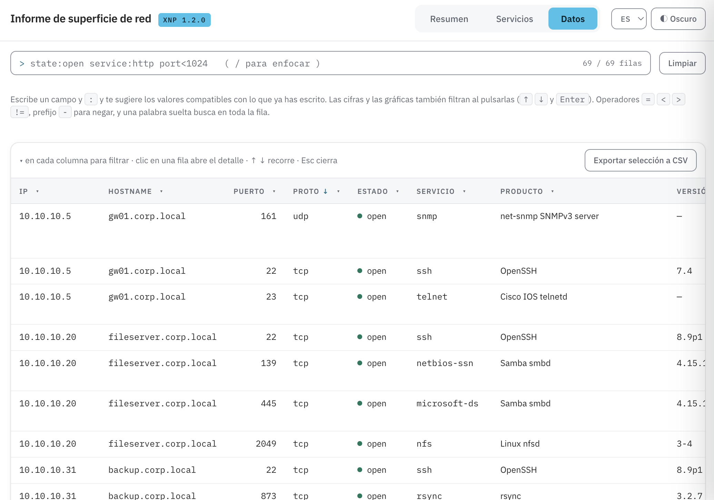

<h1 align="center">XNP — Xtreme Nmap Parser</h1>

<p align="center">
  <b>Entra XML de nmap. Salen CSV, XLSX, JSON y un informe HTML interactivo y autocontenido.</b>
</p>

<p align="center">
  <a href="https://github.com/xtormin/XtremeNmapParser/actions/workflows/ci.yml"></a>
  
  
  
</p>

<p align="center">
  <a href="README.md">English</a> · <b>Español</b>
</p>

<p align="center">
  <a href="#instalación">Instalación</a> ·
  <a href="#comandos-habituales">Comandos</a> ·
  <a href="#flags">Flags</a> ·
  <a href="#reescaneo-dirigido">Reescaneo</a> ·
  <a href="#el-informe-html">Informe HTML</a> ·
  <a href="#configuración">Configuración</a> ·
  <a href="#conviene-saber">Conviene saber</a> ·
  <a href="#desarrollo">Desarrollo</a>
</p>



---

## Instalación

```bash
git clone https://github.com/xtormin/XtremeNmapParser.git
cd XtremeNmapParser
pip install .
```

Eso te deja un comando `xnp` que funciona desde cualquier directorio.

```bash
xnp -f examples/single-host-deep.xml
xnp -f examples/single-host-deep.xml --show
```

Escribe `scan.csv`, `scan.xlsx`, `scan.json` y `scan.html` junto al fichero de
entrada.

Creación del informe con toda la información de una carpeta de forma recursiva:

```bash
xnp -d examples --show
```

Lo mismo, pero con idioma en español:

```bash
xnp -d examples --show --lang es
```

---

## Comandos habituales

| Quiero… | Comando |
| --- | --- |
| Parsear un escaneo a todos los formatos | `xnp -f scan.xml` |
| Solo el informe HTML | `xnp -f scan.xml -oF html` |
| Solo los puertos abiertos, en hoja de cálculo | `xnp -f scan.xml --open -oF xlsx` |
| **Una carpeta entera fusionada en un informe** | `xnp -d nmap/` |
| Lo mismo, solo puertos abiertos y todas las columnas | `xnp -d nmap/ --open -C all` |
| Parsear una carpeta y abrir el informe | `xnp -d nmap/ --show` |
| Una carpeta entera: un informe por fichero | `xnp -d nmap/ --no-merger` |
| Quedarse en el primer nivel | `xnp -d nmap/ --no-recursive` |
| Elegir el nombre de salida | `xnp -d nmap/ -oN cliente-interna` |
| Leer salida de masscan | `xnp -f masscan.xml --no-validate` |

`csv`, `xlsx` y `json` llevan la misma tabla plana: una fila por host/puerto. El
XLSX es una tabla de Excel de verdad, con los filtros ya puestos.

---

## Flags

| Flag | Qué hace |
| --- | --- |
| `-f`, `--file` | Parsea un único fichero XML de nmap |
| `-d`, `--directory` | Parsea todos los XML de un directorio |
| `--no-recursive` | Se queda en el primer nivel de `-d` en vez de bajar a los subdirectorios |
| `--no-merger` | Un informe por fichero XML en vez de uno fusionado |
| `-oF`, `--outputformat` | `csv`, `html`, `json`, `xlsx` (por defecto, los cuatro) |
| `-oN`, `--outputname` | Nombre del fichero de salida, sin extensión |
| `-C`, `--columns` | `default` o `all` (añade la columna `Scripts`). El informe HTML siempre lo enseña todo |
| `--open` | Exporta solo los puertos cuyo estado es `open` |
| `--show` | Abre el informe HTML generado en el navegador al terminar |
| `--rescan` | Imprime los comandos de nmap que reescanean solo lo que esta ejecución encontró. Acepta un nombre de perfil de `config.yaml`; sin nombre, el que esté por defecto |
| `--rescan-args` | Reescanea con estos argumentos de nmap en vez de con un perfil: `--rescan-args="-sV --script vuln"` |
| `--include-hostless` | Emite también una fila para los hosts sin puertos. Desactivado por defecto |
| `--no-validate` | Salta la validación DTD — para salida compatible con nmap de otros escáneres |
| `--lang` | `en` o `es` para el terminal y el idioma inicial del informe |
| `-v` / `-q` | Log de depuración / solo errores y rutas de salida (excluyentes) |
| `--no-color` | Desactiva el color (`NO_COLOR` hace lo mismo) |
| `--update`, `--version` | Actualiza a la última versión / imprime la versión |

Una carpeta se fusiona y se recorre entera por defecto: `-d nmap/` lee todos los
XML que hay bajo `nmap/`, subdirectorios incluidos, y escribe un único informe
con la fila más detallada por IP/puerto. `--no-merger` y `--no-recursive`
desactivan cada mitad; `-M` y `-R` se siguen aceptando, y ahora solo dicen lo
que ya ocurre.

Sin `-oN`, la salida se nombra a partir del fichero de entrada
(`scan.xml` → `scan.html`). Un informe fusionado se nombra con la carpeta de la
que sale y la fecha y hora, y se escribe **dentro de esa carpeta**:
`xnp -d nmap/` → `nmap/nmap_20260910-134500.html`. La marca de tiempo hace que
una segunda pasada añada un informe en vez de pisar el entregable de ayer. `-oN`
manda sobre todo esto y se respeta tal cual, relativo a donde lanzaste el
comando.

Como el nombre ya no es algo que puedas escribir de memoria, `--show` te abre el
informe al terminar. Las rutas generadas siguen saliendo por stdout
—`xnp -d nmap/ | grep '\.html$'` te da el mismo nombre para un script— y una
máquina sin navegador recibe un aviso, no un run fallido.

---

## Reescaneo dirigido

```bash
xnp -d nmap/ --rescan
```

Un escaneo terminado ya sabe qué hosts están vivos y qué puertos tienen
abiertos, que es justo lo que necesita la siguiente pasada. `--rescan` imprime
los comandos de nmap que apuntan solo a eso, para no volver a barrer un host
entero:

```
# 1 host  tcp 22,23  udp 161
nmap -sV -sC --version-all -Pn -sS -sU -p T:22,23,U:161 10.10.10.5
# 1 host  tcp 22,873
nmap -sV -sC --version-all -Pn -p 22,873 10.10.10.31
```

En nmap la lista de puertos se aplica a todos los objetivos de la invocación,
así que los hosts se agrupan **por firma de puertos**: los que tienen
exactamente el mismo conjunto de puertos abiertos comparten comando, y a ninguno
se le manda un puerto que no tiene.

`--rescan` acepta un nombre de perfil de la configuración, o nada para el que
esté por defecto. `--rescan-args` sustituye los argumentos por completo — ojo al
`=`, o argparse lee el guion inicial como un flag:

```bash
xnp -d nmap/ --rescan vuln
```

```bash
xnp -d nmap/ --rescan-args="-sV --script vuln -Pn"
```

La lista de puertos, los tipos de escaneo y `-6` se deciden por grupo, así que
`-p`/`-F`/`--top-ports`/`-sn`/`-6` en un perfil se descartan con un aviso. Un
grupo UDP lleva `-sU` y prefijos `U:`; uno mixto lleva además un tipo TCP
explícito, porque `-sU` sin él hace que nmap ignore la mitad `T:`. A un grupo
solo TCP se le deja el comportamiento por defecto de nmap salvo que el perfil
pidiera uno, de modo que un `-sT` deliberado se respeta. Las direcciones se
validan antes de llegar a una línea de comandos.

El mismo generador está detrás del control de reescaneo del informe HTML, en la
barra de herramientas de las pestañas *Servicios* y *Datos*, donde copia los
comandos de lo que haya dejado el filtro. Los comandos de la terminal van a
stderr, así que stdout sigue siendo la lista limpia de rutas generadas.

---

## El informe HTML

```bash
xnp -f scan.xml -oF html --show
```

Un solo fichero y ni una petición de red: hoja de estilos, script, tipografías,
gráficas y datos van incrustados, así que se abre en un portátil sin red y
sobrevive a que lo mandes por correo.

| Pestaña | Qué responde |
| --- | --- |
| **Resumen** | ¿Qué hay expuesto? Cinco cifras y seis gráficas, y cada una filtra los datos al pulsarla |
| **Servicios** | ¿Y ahora qué? Puertos abiertos agrupados por servicio, con listas de objetivos de un clic (`host:puerto`, IP, URL o [comandos de reescaneo](#reescaneo-dirigido)) |
| **Datos** | Todo lo que produjo nmap: columnas ordenables, filtros estilo Excel y un panel de detalle por fila |

Las tres comparten un filtro, y todas las cifras se recalculan sobre él. La
barra de consulta acepta `state:open service:http port<1024 -interest:low` y
autocompleta los valores que hay realmente en el escaneo. Los puertos abiertos
llevan un nivel de *interés* y etiquetas que dicen de qué tipo de cosa se trata:
señala qué merece un vistazo, no qué es vulnerable. Español/inglés y
claro/oscuro, conmutables desde la cabecera.

**[Visita guiada del informe](docs/html-report.es.md)** — lenguaje de consulta,
formatos de copiado, etiquetas de interés, fusión de escaneos, tema y contraste.

---

## Configuración

Todo funciona tal cual. Para cambiar los valores por defecto, edita
[config/config.yaml](config/config.yaml): las columnas de cada opción de `-C`,
el estilo del XLSX, los títulos del informe HTML y el bloque `rescan:`, con los
perfiles de nmap que ofrecen `--rescan` y el botón `nmap` del informe, y a qué
estados de puerto apuntan. Un perfil añadido ahí se suma a los que vienen de
serie; redefinir uno lo sustituye. XNP lee la copia que va
dentro del paquete, luego `./config/config.yaml` y luego `$XNP_CONFIG`, en ese
orden de precedencia.

| Variable de entorno | Efecto |
| --- | --- |
| `XNP_CONFIG` | Ruta a un fichero de configuración que se impone al resto |
| `XNP_NO_UPDATE_CHECK=1` | Se salta la comprobación de versión al arrancar |
| `NO_COLOR` | Desactiva el color |
| `LC_ALL` / `LC_MESSAGES` / `LANG` | Eligen el idioma, salvo que `--lang` diga otra cosa |

---

## Conviene saber

- **La entrada se valida en tres capas:** el parser XML no expande entidades
  externas ni toca la red, la raíz tiene que ser `<nmaprun>` y el informe se
  comprueba contra el `nmap.dtd` incluido. Ese DTD fija `scanner="nmap"`, así
  que la salida `-oX` de masscan —o cualquier otro XML compatible con nmap—
  necesita `--no-validate`. Las herramientas que no tienen salida XML propia
  (naabu, por ejemplo) no dan nada que meter aquí: pásalas por nmap
  (`naabu -nmap-cli 'nmap -sV -oX scan.xml'`) y ese XML valida sin más.
- **Un fichero malo no hunde el parseo de un directorio.** Con `-d` se avisa del
  fichero, se salta y el resto se parsea igual; al final XNP nombra lo que se
  saltó. Con `-f` termina la ejecución, porque nombraste ese fichero.
- **Por stdout salen las rutas generadas y nada más**, una por línea. El banner,
  la barra de progreso, los avisos y el resumen van por stderr, así que
  `xnp -d nmap/ -oF csv > escritos.txt` te deja una lista utilizable. En un
  script, `--quiet`.
- **Códigos de salida:** `0` todo bien · `1` error · `2` XML inválido o que no
  es de nmap · `3` sin ficheros de entrada.
- **¿Vienes de una versión antigua?** En la v1.2.0 cambian dos cosas: `-d`
  ahora fusiona y baja a los subdirectorios por defecto (`-M` y `-R` ya no
  hacen falta y se siguen aceptando; `--no-merger` y `--no-recursive`
  desactivan cada mitad), y el informe fusionado se escribe dentro de la
  carpeta parseada con la fecha y la hora en el nombre, en vez de
  `merged_nmap_scan_data` en el directorio actual. El código, además, se movió
  de `app/` al paquete `xnp/`, así que las rutas de la wiki están desfasadas.
  `xnp --update` trae la última.

[`examples/`](examples) contiene escaneos sintéticos de una LAN interna, una
DMZ, un dominio Windows y salida de masscan — ver
[examples/README.md](examples/README.md).

---

## Desarrollo

```bash
pip install -e ".[dev]"
pytest --cov=xnp --cov-report=term-missing
ruff check xnp tests scripts xnp.py
```

CI ejecuta la suite en Python 3.9 – 3.13.

---

## Licencia y enlaces

MIT — ver [LICENSE](LICENSE). Historial de versiones en
[CHANGELOG.es.md](CHANGELOG.es.md).

[xtormin.com](https://xtormin.com) ·
[LinkedIn](https://www.linkedin.com/in/xtormin/) ·
[Twitter](https://twitter.com/xtormin) ·
[YouTube](https://www.youtube.com/channel/UCZs7q5QeyXS5YmUq6lexozw) ·
[Instagram](https://www.instagram.com/xtormin/)
