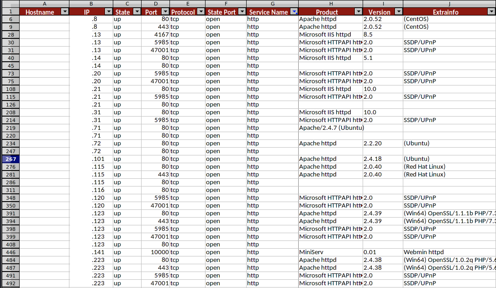

# XNP - Xtreme Nmap Parser
This program extracts the most pertinent information from an **XML file generated by a nmap scan**, then converts it into **CSV or XLSX format**.

This is **particularly useful when tasked with analyzing a large number of hosts** as it enables quicker, more efficient filtering and testing.

For instance, you can:

- Filter based on open ports or services.
- Exclude ports that appear to be open, but are irrelevant for testing.
- Maintain a record of what has been analyzed.
- If a vulnerable service is detected, rapidly search for other potentially vulnerable hosts.
- Copy and paste data of vulnerable hosts, filtered by service version.

The following image is an example of the output information in XLSX format:



## Install

```
git clone https://github.com/xtormin/XtremeNmapParser.git
```

### Python requirements

```
python3 -m pip install -r setup/requirements.txt
```

### Virtual environment

```
sudo apt install python3-venv
```

To create a python virtual environment:

```
python3 -m venv venv
source venv/bin/activate
python3 -m pip install -r setup/requirements.txt
```

## Execution

Example of nmap scan:

```
nmap -T4 -Pn -open --script=default,version,vuln -A -p- -oA nmap/tcp-full-scripts 10.10.1.9
```

### Single XML file

Using the tcp-full-scripts.xml file created, execute this tool:

```
python3 xnp.py -f nmap/tcp-full-scripts.xml -o csv,xlsx
```


### Folder with XML files

If you have multiple files in 'nmap/' (e.g.: nmap/tcp-full-scripts.xml), run the following command to parse all the .xml files you have in the folder.

```
python3 xnp.py -d nmap/ -o csv,xlsx
```


The csv and/or xlsx will be saved in the same location as the original.

If you want to save all csv's in the same file, you can do the following:

```
echo "Hostname;IP;State;Port;Protocol;State Port; Service Name; Product; Version; Extrainfo" > /tmp/all-csv-to-one-file.csv
cat */nmap/*.csv >> /tmp/all-csv-to-one-file.csv
```

To convert the information from CSV to XLSX and delete duplicates, you can use this script:

```
python3 scripts/csvtoxlsx.py -c /tmp/all-csv-to-one-file.csv
```

### Output

You will get the following columns with scanner information:

```
Hostname;IP;State;Port;Protocol;State Port; Service Name; Product; Version; Extrainfo
xtormin.local;10.10.1.9;up;445;tcp;open;microsoft-ds;Windows Server 2016 Standard 14393 microsoft-ds;;
xtormin.local;10.10.1.9;up;1433;tcp;open;ms-sql-s;Microsoft SQL Server 2017;"14.00.1000.00; RTM";
xtormin.local;10.10.1.9;up;3389;tcp;open;ms-wbt-server;Microsoft Terminal Services;;
```