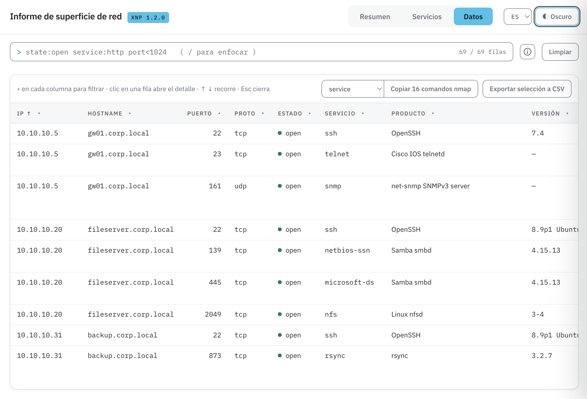

<h1 align="center">XNP — Xtreme Nmap Parser</h1>

<p align="center">
  <b>Nmap XML in. CSV, XLSX, JSON and a self-contained interactive HTML report out.</b>
</p>

<p align="center">
  
  
  
</p>

<p align="center">
  <b>English</b> · <a href="README.es.md">Español</a>
</p>

<p align="center">
  <a href="#install">Install</a> ·
  <a href="#common-commands">Commands</a> ·
  <a href="#other-command-examples">More examples</a> ·
  <a href="#flags">Flags</a> ·
  <a href="#targeted-rescan">Rescan</a> ·
  <a href="#the-html-report">HTML report</a> ·
  <a href="#configuration">Config</a> ·
  <a href="#good-to-know">Good to know</a> ·
  <a href="#development">Development</a>
</p>



---

## Install

```bash
git clone https://github.com/xtormin/XtremeNmapParser.git
cd XtremeNmapParser
pip install .
```

That gives you an `xnp` command that works from any directory.

## Common commands

* **One file:**

```bash
xnp -f examples/single-host-deep.xml
xnp -f examples/single-host-deep.xml --show
```

Writes `single-host-deep.csv`, `.xlsx`, `.json` and `.html` next to the input
file.

* **A folder with several files:**

Build one report out of a whole folder, recursively:

```bash
xnp -d examples --show
```

The same, with the terminal and the report in Spanish (es) or English (en):

```bash
xnp -d examples --show --lang es
```

---

## Other command examples

| I want to… | Command |
| --- | --- |
| Parse one scan into every format | `xnp -f scan.xml` |
| Get just the HTML report | `xnp -f scan.xml -oF html` |
| Only open ports, as a spreadsheet | `xnp -f scan.xml --open -oF xlsx` |
| **Parse a folder, merged into one report** | `xnp -d nmap/` |
| The same, only open ports and every column | `xnp -d nmap/ --open -C all` |
| Parse a folder and open the report | `xnp -d nmap/ --show` |
| Parse a folder — one report per file | `xnp -d nmap/ --no-merger` |
| Stay at the top level | `xnp -d nmap/ --no-recursive` |
| Choose the output name | `xnp -d nmap/ -oN client-internal` |
| Read masscan output | `xnp -f masscan.xml --no-validate` |

`csv`, `xlsx` and `json` all carry the same flat table — one row per host/port.
The XLSX is a real Excel table with the filters already on.

---

## Flags

| Flag | What it does |
| --- | --- |
| `-f`, `--file` | Parse a single nmap XML file |
| `-d`, `--directory` | Parse every XML file in a directory |
| `--no-recursive` | Stay at the top level of `-d` instead of descending into subdirectories |
| `--no-merger` | One report per XML file instead of one merged report |
| `-oF`, `--outputformat` | `csv`, `html`, `json`, `xlsx` (default: all four) |
| `-oN`, `--outputname` | Output file name, without extension |
| `-C`, `--columns` | `default` or `all` (adds the `Scripts` column). The HTML report always shows everything |
| `--open` | Export only ports whose state is `open` |
| `--show` | Open the generated HTML report in the browser when the run finishes |
| `--rescan` | Print the nmap commands that rescan only what this run found. Takes a profile name from `config.yaml`; without one, the configured default |
| `--rescan-args` | Rescan with these nmap arguments instead of a profile: `--rescan-args="-sV --script vuln"`. Takes `$[...]` [variables](#variables) |
| `--include-hostless` | Also emit a row for hosts with no ports. Off by default |
| `--no-validate` | Skip DTD validation — for nmap-compatible output from other scanners |
| `--lang` | `en` or `es` for the terminal and the report's initial language |
| `-v` / `-q` | Debug logging / only errors and output paths (mutually exclusive) |
| `--no-color` | Disable colour (`NO_COLOR` does the same) |
| `--update`, `--version` | Update to the latest release / print the version |

A directory run merges and descends by default: `-d nmap/` reads every XML
under `nmap/`, including its subdirectories, and writes a single report keeping
the most detailed row per IP/port. `--no-merger` and `--no-recursive` turn each
half off; `-M` and `-R` still parse, and now just say what already happens.

Without `-oN`, output is named after the input file (`scan.xml` → `scan.html`).
A merged run is named after the folder it came from, stamped with the time, and
written **inside that folder**: `xnp -d nmap/` → `nmap/nmap_20260910-134500.html`.
The stamp means a second run adds a report rather than overwriting yesterday's
deliverable. `-oN` overrides all of it and is taken exactly as given, relative
to where you ran the command.

Since the name is no longer something you can type from memory, `--show` opens
the report for you when the run finishes. The generated paths still go to
stdout — `xnp -d nmap/ | grep '\.html$'` gets you the same name for a script —
and a machine with no browser gets a warning, not a failed run.

---

## Targeted rescan

```bash
xnp -d examples/ --rescan
```

A finished scan already knows which hosts are up and which ports they have
open — which is exactly what the next pass needs. `--rescan` prints the nmap
commands that aim at only that, so you never sweep a whole host twice:

```
# 1 host  tcp 22,23  udp 161
nmap -sV -sC --version-all -Pn -sS -sU -p T:22,23,U:161 10.10.10.5
# 1 host  tcp 22,873
nmap -sV -sC --version-all -Pn -p 22,873 10.10.10.31
```

nmap applies one port list to every target of an invocation, so hosts are
grouped **by port signature**: those whose open ports are exactly the same set
share a command, and no host is ever sent a port it does not have.

`--rescan` takes a profile name from the configuration, or nothing for the
configured default. `--rescan-args` replaces the arguments outright — note the
`=`, or argparse reads the leading dash as a flag:

```bash
xnp -d examples/ --rescan vuln
```

```bash
xnp -d examples/ --rescan-args="-sV --script vuln -Pn"
```

### Variables

The arguments may carry `$[...]` variables, replaced per command — which is how
each command gets an output file of its own instead of overwriting the previous
one's:

```bash
xnp -d examples/ --rescan-args='-sV -oA scans/$[HOSTNAME] -Pn'
```

```
nmap -sV -oA scans/db.lab.local -Pn -p 5432 10.0.0.20
nmap -sV -oA scans/10.0.0.3 -Pn -sS -sU -p T:443,U:53 10.0.0.3
```

| Variable | Value |
| --- | --- |
| `$[IP]` | The host's address |
| `$[HOSTNAME]` | The name the scan resolved, or the address when it resolved none |
| `$[PORTS]` | The `-p` value of the command, prefixes included: `T:443,U:53` |
| `$[TCP_PORTS]` · `$[UDP_PORTS]` | Either half on its own, or empty |

`$[IP]` and `$[HOSTNAME]` name a **single host**, so using one splits its group
into one command per host: a value that differs from host to host cannot be
written once into a command they share. The other three are the same for every
host of a group and leave the grouping alone.

Note the **single** quotes around the whole argument: `$[...]` is bash's
deprecated arithmetic expansion, so `--rescan-args="… $[IP]"` would reach XNP
already mangled by your own shell. Inside `config.yaml` there is no shell and
nothing to quote.

Quotes **inside** the arguments are kept as you wrote them, because they may be
load-bearing and only you know whether the path has a space in it:

```bash
xnp -d examples/ --rescan-args='-oA "nmap/$[HOSTNAME] deep"'
```

```
nmap -oA "nmap/db.lab.local deep" -p 5432 10.0.0.20
```

A token written bare comes out bare when it does not need quoting, and quoted
when it does.

The brackets are what tells an XNP variable from an environment variable you
may also want in the line. A name that is not one of these is left in the
command rather than blanked out, so a typo is visible instead of silently
deleting half a flag. A hostname is treated like an address: it comes from the
XML, so anything a shell would read is dropped, not escaped. The report's
`custom` box takes the same variables, and needs no quoting.

The port list, the scan types and `-6` are decided per group, so `-p`/`-F`/
`--top-ports`/`-sn`/`-6` in a profile are dropped with a warning. A UDP group
gets `-sU` and `U:` prefixes; a mixed group also gets an explicit TCP type,
because `-sU` without one makes nmap ignore the `T:` half. A TCP-only group is
left to nmap's own default unless the profile asked for one, so a deliberate
`-sT` survives. Addresses are validated before they reach a command line.

The same generator sits behind the HTML report's rescan control, in the toolbar
of the *Services* and *Data* tabs, where it copies the commands for whatever
the filter has left. The terminal's commands go to stderr, so stdout stays the
clean list of generated paths.

---

## The HTML report

```bash
xnp -f examples/single-host-deep.xml -oF html --show
```

One file, no network requests: stylesheet, script, fonts, charts and scan data
are all inlined, so it opens on an air-gapped laptop and survives being emailed.

| Tab | What it answers |
| --- | --- |
| **Summary** | What is exposed? Five figures and six charts, each one clickable into the data |
| **Services** | What do I do next? Open ports grouped by service, with one-click target lists (`host:port`, IPs, URLs, or [rescan commands](#targeted-rescan)) |
| **Data** | Everything nmap produced: sortable columns, Excel-style filters, a detail panel per row |

One filter is shared across all three, and every figure recomputes from it. The
query bar takes `state:open service:http port<1024 -interest:low` and completes
the values actually present in the scan. Open ports carry an *interest* level
and tags saying what kind of thing they are — it says what deserves a look, not
what is vulnerable. Spanish/English and light/dark, switchable in the header.

**[Full tour of the report](docs/html-report.md)** — query language, target
shapes, interest labels, merging scans, theming and contrast.

---

## Configuration

Everything works out of the box. To change defaults, edit
[config/config.yaml](config/config.yaml) — the columns each `-C` choice selects,
the XLSX styling, the HTML report titles, and the `rescan:` block: the nmap
profiles `--rescan` and the report's `nmap` button offer, and which port states
they aim at. A profile added there joins the packaged ones; redefining one
replaces it. XNP reads the copy bundled with
the package, then `./config/config.yaml`, then `$XNP_CONFIG`, in that order of
precedence.

| Environment variable | Effect |
| --- | --- |
| `XNP_CONFIG` | Path to a config file that overrides the rest |
| `XNP_NO_UPDATE_CHECK=1` | Skip the startup version check |
| `NO_COLOR` | Disable colour |
| `LC_ALL` / `LC_MESSAGES` / `LANG` | Pick the language, unless `--lang` says otherwise |

---

## Good to know

- **Input is validated in three layers:** the XML parser expands no external
  entities and never touches the network, the root must be `<nmaprun>`, and the
  report is checked against the bundled `nmap.dtd`. That DTD pins
  `scanner="nmap"`, so masscan's `-oX` output — or any other nmap-compatible
  XML — needs `--no-validate`. Tools that have no XML output of their own
  (naabu, for one) have nothing to feed here: run them through nmap instead
  (`naabu -nmap-cli 'nmap -sV -oX scan.xml'`) and the XML validates as usual.
- **One bad file does not sink a directory run.** With `-d`, an invalid file is
  reported, skipped, and everything else still parses; XNP names what it skipped
  at the end. With `-f` it ends the run, because you named that one file.
- **stdout carries the generated paths and nothing else** — one bare path per
  line. The banner, progress bar, warnings and summary all go to stderr, so
  `xnp -d nmap/ -oF csv > written.txt` leaves you a usable list. `--quiet` is
  the shape you want in a script. On a terminal, where nothing is reading that
  list and the *Output files* table has already named every file with its
  format and its size, the bare paths are not printed a second time.
- **Exit codes:** `0` success · `1` error · `2` invalid or non-nmap XML ·
  `3` no input files found.
- **Coming from an older version?** Two things changed in v1.2.0: `-d` now
  merges and recurses by default (`-M` and `-R` are no longer needed and still
  parse; `--no-merger` and `--no-recursive` opt out), and the merged report is
  written inside the parsed folder under a timestamped name instead of
  `merged_nmap_scan_data` in the current directory. The code also moved from
  `app/` to the `xnp/` package, so the old wiki paths are stale.
  `xnp --update` pulls the latest.

[`examples/`](examples) holds synthetic scans covering an internal LAN, a DMZ, a
Windows domain and masscan output — see [examples/README.md](examples/README.md).

---

## Development

```bash
pip install -e ".[dev]"
pytest --cov=xnp --cov-report=term-missing
ruff check xnp tests scripts xnp.py
```

CI runs the suite on Python 3.9 – 3.13.

---

## License

MIT — see [LICENSE](LICENSE). Version history in [CHANGELOG.md](CHANGELOG.md).

## Social links

[xtormin.com](https://xtormin.com) ·
[LinkedIn](https://www.linkedin.com/in/xtormin/) ·
[Twitter](https://twitter.com/xtormin) ·
[YouTube](https://www.youtube.com/channel/UCZs7q5QeyXS5YmUq6lexozw) ·
[Instagram](https://www.instagram.com/xtormin/)
